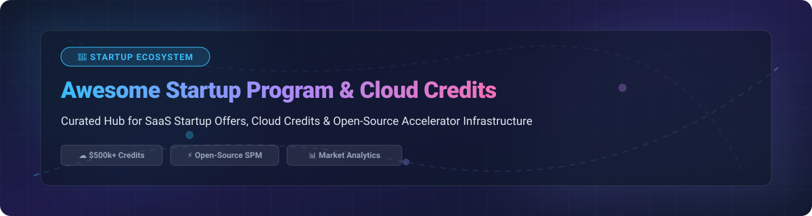

  
  
  
  
  

  

# 🚀 Awesome Startup Program & Cloud Credits Platform ☁️

> **The ultimate curated directory of commercial startup programs, cloud hosting credits, SaaS perks, and open-source accelerator infrastructure.**

Welcome to the definitive ecosystem index for early-stage startup founders, CTOs, accelerator managers, and open-source creators seeking free cloud credits, software perks, grant tracking, and program management tooling.

---

## 📚 Table of Contents
- [📊 Sector Market Dynamics](#-sector-market-dynamics)
- [🏢 SaaS & Cloud Startup Credit Platforms](#-saas--cloud-startup-credit-platforms)
- [🛠️ Open-Source Accelerator & Credit Infrastructure](#️-open-source-accelerator--credit-infrastructure)
- [🎁 Cloud Provider Always-Free Tiers](#-cloud-provider-always-free-tiers)
- [🤝 How to Contribute](#-how-to-contribute)
- [💖 Support & Sponsorship](#-support--sponsorship)
- [📈 Star History](#-star-history)
- [📜 Disclaimer](#-disclaimer)

---

## 📊 Sector Market Dynamics

> **📊 Market Size & Industry Structure**: The global cloud computing market is valued at **~$675 Billion+** (with cloud startup credits & perk programs representing an estimated **~$5 Billion+ annual perk economy**). The cloud infrastructure segment is **highly concentrated** among hyper-scaler cloud giants (AWS, Microsoft Azure, Google Cloud) controlling over 65% of total market share, while specialized developer tools, CRM, payments, and open-source management platforms operate in a **moderately fragmented** secondary tier.

---

## 🏢 SaaS & Cloud Startup Credit Platforms

Below is a detailed comparison of major startup programs, sorted in **descending order by company valuation / market capitalization**.

| 🏢 Product / Program | 💰 Valuation / Annual Revenue | 🏷️ Starting Paid Tier Price | 🎁 Free Tier Limit / Free Trial | 🚀 Startup Program Credits & Offer Details |
| :--- | :--- | :--- | :--- | :--- |
| **[Microsoft Founders Hub](https://www.microsoft.com/en-us/startups)** | **$3.1 Trillion Market Cap** (~$35B+ Azure Annual Rev) | $13.00/user/month (M365 Business Basic & Azure App Services) | 12 Months Free ($200 credit for 30 days + 55+ always free services) | **Up to $150,000 in Azure credits**, OpenAI credits, GitHub Enterprise, M365, and expert mentorship. |
| **[AWS Activate](https://aws.amazon.com/activate/)** | **$2.1 Trillion Market Cap** (~$105B AWS Annual Rev) | $29.00/month (Developer Support Tier) | 12 Months Free Tier (1M Lambda req/mo, 5GB S3, 750 hrs EC2/mo) | **Up to $100,000 in AWS credits**, technical support, architecture guidance, and founder resources. |
| **[Google for Startups](https://cloud.google.com/startup)** | **$2.0 Trillion Market Cap** (~$33B GCP Annual Rev) | $10.00/month (Google Workspace Starter Tier) | $300 credit valid for 90 days + 20+ Always Free Cloud Products | **Up to $200,000 in Google Cloud credits** over 2 years, Google Workspace & Firebase perks. |
| **[Oracle for Startups](https://www.oracle.com/startup/)** | **$480 Billion Market Cap** (~$53B Annual Rev) | $20.00/month (Oracle Cloud Infrastructure Starter Instance) | Always Free Tier (2 Ampere ARM VMs with 24GB RAM, 200GB Storage) | **70% discount on OCI** for 2 years, up to $10,000 in cloud credits + technical support. |
| **[IBM Global Entrepreneur](https://www.ibm.com/startups)** | **$210 Billion Market Cap** (~$62B Annual Rev) | $25.00/month (IBM Cloud Kubernetes & Bare Metal Tier) | IBM Cloud Free Tier (40+ Always Free services + $200 trial credit) | **Up to $120,000/year in IBM Cloud credits**, Watson AI access & 1-on-1 technical mentoring. |
| **[Stripe Atlas](https://stripe.com/atlas)** | **$65 Billion Valuation** (~$14B Annual Rev) | $500.00 one-time setup fee + 2.9% + 30¢ per transaction | Stripe Payments Free Sandbox / Test Mode (No monthly fee) | **US Company Incorporation ($500 package)**, Delaware filing, US bank account & $100k+ partner perks. |
| **[HubSpot for Startups](https://www.hubspot.com/startups)** | **$30 Billion Market Cap** (~$2.2B Annual Rev) | $15.00/user/month (HubSpot Starter Customer Platform) | Free Forever Plan (1,000 contacts, free CRM, live chat & forms) | **Up to 90% off HubSpot CRM** & Marketing Hub in Year 1, 50% off Year 2, 25% off ongoing. |
| **[Segment Startup Program](https://segment.com/industry/startups/)** | **$8 Billion Valuation** (Twilio Segment ~$4.1B Rev) | $120.00/month (Segment Team Plan up to 10k MTUs) | Free Forever Plan (1,000 MTUs/month, 2 source integrations, 300+ destinations) | **$25,000 in Segment credits** for 12 months + access to startup deal perks & analytics coaching. |
| **[DigitalOcean Hatch](https://www.digitalocean.com/hatch)** | **$3.5 Billion Market Cap** (~$720M Annual Rev) | $4.00/month (Basic Droplet 512MB RAM / 1 vCPU) | $200 free credit valid for 60 days for all new account signups | **Up to $100,000 in DigitalOcean cloud credits** for 12 months + technical support & community. |
| **[OVHcloud Startup Program](https://www.ovhcloud.com/en/startup-program/)** | **$1.8 Billion Market Cap** (~$960M Annual Rev) | €3.50/month (€0.005/hour VPS Starter Instance) | €200 free trial credit valid for 30 days for public cloud testing | **Up to €100,000 in cloud credits** over 12 months, sovereign EU cloud hosting & dedicated support. |

---

## 🛠️ Open-Source Accelerator & Credit Infrastructure

Below is a curated collection of open-source frameworks, program management platforms, and developer tooling for building startup programs, grants, and community funds. Sorted in **descending order by GitHub Stars_Count**.

| 📦 Repository & Project Name | ⭐ GitHub_Stars_Badge | 📝 Description & Primary Focus |
| :--- | :--- | :--- |
| **[n8n-io / n8n](https://github.com/n8n-io/n8n)** |  | **Fair-code workflow automation platform** for connecting startup onboarding APIs, credit claims, and Slack/Discord alerts. |
| **[calcom / cal.com](https://github.com/calcom/cal.com)** |  | **Open-source scheduling infrastructure** for startup office hours, VC mentorship sessions, and founder check-ins. |
| **[posthog / posthog](https://github.com/posthog/posthog)** |  | **Open-source product analytics & feature flags** suite tailored for startup growth and user behavioral tracking. |
| **[dubinc / dub](https://github.com/dubinc/dub)** |  | **Open-source link management platform** for startup referral campaigns, credit redemption links, and custom domain shorteners. |
| **[formbricks / formbricks](https://github.com/formbricks/formbricks)** |  | **Open-source Experience Management (XM)** & survey engine for startup feedback, program application forms, and founder onboarding. |
| **[score-spec / score](https://github.com/score-spec/score)** |  | **Developer-centric workload specification** for workload portability across multi-cloud startup credit environments. |
| **[last9 / spm](https://github.com/last9/spm)** |  | **Startup Program Manager (SPM)** — platform-agnostic framework for defining credits, eligibility, and provider adapters in YAML. |
| **[opengrants / opengrants](https://github.com/opengrants/opengrants)** |  | **Open-source grant discovery platform** aggregating non-dilutive government and foundation funding opportunities for startups. |
| **[mayadata-io / maya](https://github.com/mayadata-io/maya)** |  | **Startup program lifecycle automation** platform managing vouchers, claims, approval flows, and cloud billing integrations. |
| **[osFunding / osFunding](https://github.com/osFunding/osFunding)** |  | **Transparent community funding platform** utilizing smart contracts for open-source project disbursement and grants. |
| **[openstartup / openstartup](https://github.com/openstartup/openstartup)** |  | **Lightweight open-source program management** system for application intake, review workflows, and credit tracking. |
| **[startupos / startupos](https://github.com/startupos/startupos)** |  | **Modular operating system for accelerators** providing CRM, application management, credit tracking, and reporting. |

---

## 🎁 Cloud Provider Always-Free Tiers

- ☁️ **AWS Free Tier**: 12-month free tier + 100+ always-free services (1M Lambda requests, 5GB S3, 750 hrs EC2).
- 🌐 **Google Cloud Free Tier**: $300 in credits for 90 days + 20+ always-free products (BigQuery 1TB/mo, 28 instance-hrs Compute Engine).
- 🔷 **Azure Free Account**: $200 credit for 30 days + 55+ always-free services (App Service 10 apps, 750 hrs B1s VM).
- 🔴 **Oracle Cloud Free Tier**: Always-free ARM Compute (up to 4 OCPUs, 24GB RAM), 2 AMD VMs, and 200GB Block Storage.
- 🦈 **DigitalOcean Free Trial**: $200 in free credits for 60 days for testing Droplets and Kubernetes.

---

## 🤝 How to Contribute

Contributions are warmly welcomed! Please follow these simple steps:

1. 🍴 Fork the repository.
2. 📝 Add or update entries in `README.md` following the tabular layout.
3. 🔎 Ensure pricing details, free tier limits, and program benefits are specific and verifiable.
4. 🔀 Submit a Pull Request with a clear description of changes.

---

## 💖 Support & Sponsorship

If you find this repository helpful for your startup journey or accelerator operations, please consider supporting the project:

- ⭐ **Star this repository** to help others discover it!
- 🔀 **Fork & Share** it with founders, developers, and accelerator directors.
- ☕ **Buy Me a Coffee / Sponsor**: Support ongoing maintenance via the [GitHub Sponsor Dashboard](https://github.com/sponsors/ishandutta2007).

Thank you for being part of our open-source community! ❤️

---

## 📈 Star History

---

## 📜 Disclaimer

- This list is **community-curated** for educational purposes and does not constitute financial or legal advice.
- Cloud credits and startup perks are provided directly by commercial companies and are subject to change, eligibility verification, and expiration.
- Check official program guidelines and terms before committing critical application workloads.

---

  Curated with ❤️ by <a href="https://github.com/ishandutta2007"><b>Ishan Dutta</b></a> and the Open-Source Community.

